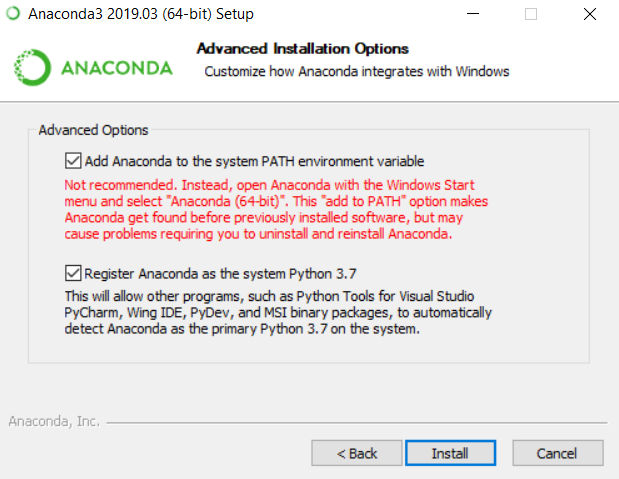
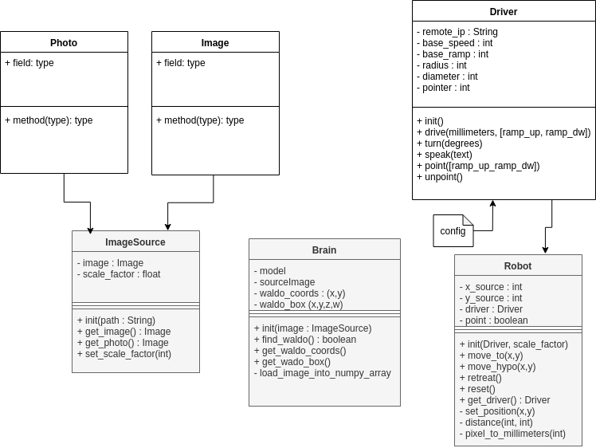

# Find Waldo
## Introduction
This is an app to find Waldo on a sheet of paper with a mobile phone camera, a Lego Mindstorms robot and AI face recognition for the workshop hack an app for Managers. 

# Prerequisites
- Lego Mindstorm ev3
- Python 3.5.3
- Pip
- Anaconda 
    - [windows](https://repo.anaconda.com/archive/Anaconda3-2019.03-Windows-x86_64.exe)
        - Be sure the two boxes are checked
			<details>
			  <summary>Installer screenshot</summary>
			  <p>

			 
			</p></details>
    - [linux](https://docs.anaconda.com/anaconda/install/linux/)
- Hotspot with IP Forwarding enabled

## Getting started
### Setup Network
Connect the notebook to the internet. Check if WLAN hotspot is active. Start robot and connect to the hotspot, find the IP adress of the robot in the windows WLAN hotspot settings.

### Start Remote python call on the robot
1. Open putty and connect via SSH to the IP of the robot:
	username robot
	password maker 
2. Run ./rpyc_server.sh

### Setup Windows
Download the repository and extract the zip file.
Then open a command prompt inside the find-waldo folder (Shift+right-click -> open command prompt here). 

#### Create an environment with Anaconda
Type the following commands
```cmd
conda create -n waldo python=3.5.3 pip
conda activate waldo
```

And then install all the dependencies with
```cmd
conda install tensorflow
pip install rpyc==3.3.0
conda install matplotlib
conda install keras
conda install pillow # PIL
conda install requests
conda install boto3

```

#### Setup the PYTHONPATH environment variable
```cmd
cd modules
setx PYTHONPATH "%cd%"
cd ..
```

### Setup Linux
Download the repository and extract the zip file.
Then open a terminal inside the find-waldo folder.

### Install dependencies
Instal lthe necessary dependencies with
```bash
# install dependencies for CentOS/Fedora
sudo yum install freetype-devel libpng-devel
```

#### Create an environment with Anaconda
```bash
conda create -n waldo python=3.5.3
conda activate waldo
```

#### Install python dependencies in the environment
```bash
conda install tensorflow
pip3 install rpyc==3.3.0
conda install matplotlib
conda install keras
conda install pillow # PIL
conda install requests
conda install boto3
```

#### Setup the PYTHONPATH environment variable
```
cd modules
export PYTHONPATH=/usr/lib/python2.7/site-packages:`pwd`:`pwd`/slim
cd ..
```

### Start the application
```
./find_waldo.py
```

## Further documentation
[remote ev3dev](https://ev3dev-lang.readthedocs.io/projects/python-ev3dev/en/stable/rpyc.html)
[ev3dev motors](https://ev3dev-lang.readthedocs.io/projects/python-ev3dev/en/stable/motors.html)

### UML class diagram


## Known issues
**Python is complaining against Visual Studio Directory path**
change environment variables
```
VSINSTALLDIR=""
VS90COMNTOOLS=""
```
