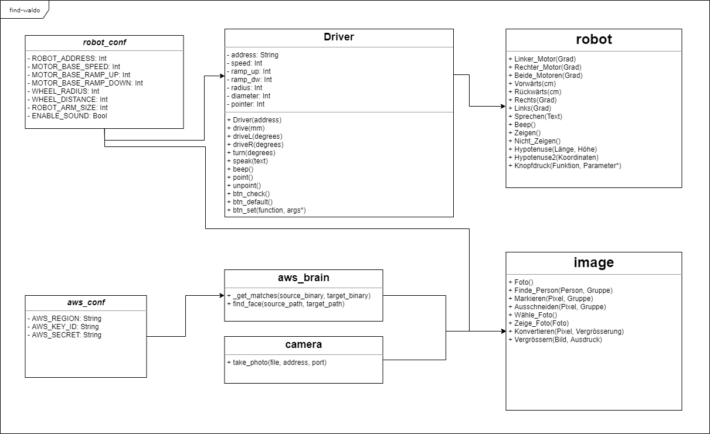

# Find Waldo
## Overview
This app is the core of Project Waldo for Hackanapp for Managers.  
It contains code for controlling a mindstorm robot, communicating with the Amazon Web Services AI, an AI to find Waldo inside a given picture and handling a smartphone as a webcam.

## Prerequisites
To use this repository, you will need the following:
- Lego Mindstorm EV3
- [ev3dev-stretch](https://github.com/ev3dev/ev3dev/releases/download/ev3dev-stretch-2019-03-03/ev3dev-stretch-ev3-generic-2019-03-03.zip)
- [Python 3.5.3](https://www.python.org/downloads/release/python-353/)
- A webcam or an Android smartphone
- Amazon Web Services [Rekognition](https://aws.amazon.com/de/rekognition/)

## Mindstorm
Flash your copy of the ev3dev-stretch zip file onto the SD card of your robot with a flash tool like [Rufus](https://github.com/pbatard/rufus/releases/download/v3.5/rufus-3.5p.exe).  
Now put the SD card back into your robot and boot it. Connect it to the same WiFi as your Computer using the robot's own interface. Afterwards connect to it with the IP it will display on the top left corner of its screen with an [SSH](https://www.howtogeek.com/336775/how-to-enable-and-use-windows-10s-built-in-ssh-commands/) client:
```cmd
ssh robot@<IP here>
``` 
The default password should be `maker`.
On the shell, install Python and pip with
```bash
sudo apt install python3 python3-pip
```
Debian Stretch doesn't currently have a newer version of Python than 3.5.3, so this project works only with that.  
As soon as the command above is finished, install [RPyC](https://pypi.org/project/rpyc/) with pip
```bash
pip3 install rpyc==3.3.0
```
which is the latest rpyc version that is distributed with Debian Stretch.
The final step is to start the RPyC server, so the script can send commands to the robot, with 
```bash
python3 rpyc_classic.py
```
Now, either keep the terminal with this SSH session open or press CTRL+Z and then type
```bash
bg
```
to run the server in the background.  

You may as well create a systemd service that automatically runs the script on boot of the robot.


## Physical appearence

The script is built around robots that use two large motors (Out B and C) with wheels and one medium motor (Out D) for a pointer as well as a touch sensor (Out 1). To fully use it, you should now build your robot accordingly.


## Python
To use the provided scripts, you have to install its dependencies.  
Currently, only the face recognition part of the script is in use, 
since the neural network for finding Waldo isn't very fast or stable.  
The dependencies you need are the following ones:
```cmd
pip install rpyc==3.3.0 pillow boto3
```
If you want to use the neural network as well, you will need additional dependencies:
```cmd
pip install matplotlib keras requests
```
and you will have to uncomment lines 2, 22 and 23 in [image.py](/image.py).

## Configuration
The modules use configuration files so static values do no have to be typed in over and over.  
There are two configuration files you have to take care of:
- [the robot and camera configuration](/modules/robot_conf.py)
- [the credentials for AWS](/modules/aws_conf.py)

Informations about the robot and camera configuration are documentated in the [documentation section](#usage).  
How to use the AWS credentials configuration can be found in the [AWS section](#amazon-web-services).


## Webcam
To take photos and process them, you will need a webcam in the same WiFi network as the rest of your devices used in this project.  
Alternatively, you can use an Android smartphone with an App like this: [IP Webcam](https://play.google.com/store/apps/details?id=com.pas.webcam)  

The IP and the Port of your webcam needs to be stored in [the configuration file](/modules/robot_conf.py) in the respective variables.

If you do not use an Android smartphone as your webcam, you might have to change the way an image is received from it in the [camera module](/modules/camera.py).

## Amazon Web Services
The face recognition part of this project is done by the AWS [Rekognition](https://aws.amazon.com/de/rekognition/).  
To use it, you will have to buy a subscription.

To configure the script to use your AWS access, create a new file called `aws_conf.py` inside the modules folder and fill it with the following content:
```
# Region
AWS_REGION = "us-east-2"

# Key ID
AWS_KEY_ID = ""

# Secret Key
AWS_SECRET = ""
```
Then visit the AWS website, get your API keys and fill them into the variables in the file above.

You do not want to change the region, as the one set here is assured to support face recognition.


## Usage

The German documentation can be found here:  
- [Robotersteuerung](/docs/Robotersteuerung.docx)  
- [Kamerasteuerung](/docs/Kamerasteuerung.docx)


## Sources
- [ev3dev rpyc](https://ev3dev-lang.readthedocs.io/projects/python-ev3dev/en/stable/rpyc.html)
- [ev3dev motors](https://ev3dev-lang.readthedocs.io/projects/python-ev3dev/en/stable/motors.html)

### UML class diagram


## Troubleshooting
The script fails with:
- "No AWS credentials" : see the [AWS scetion](#amazon-web-services)
- "Robot couldn't be reached" : make sure you have set the correct IP in the configuration file and that you are in the same network as the robot you are trying to reach.
- "Motors couldn't be reached" : make sure all your motors are connected to the correct outputs, as given in [appearence](#physical-appearence).
- "Camera couldn't be reached" : make sure you have set the correct IP in the configuration file and that you are in the same network as your camera.
- "No matches" : the person you were trying to find wasn't in the group image.

## Contact
If you have further questions about the project, please direct them towards marketing@ti8m.ch